# DesmosCollections
A collection of my DESMOS projects

# unit_circle teaching tools

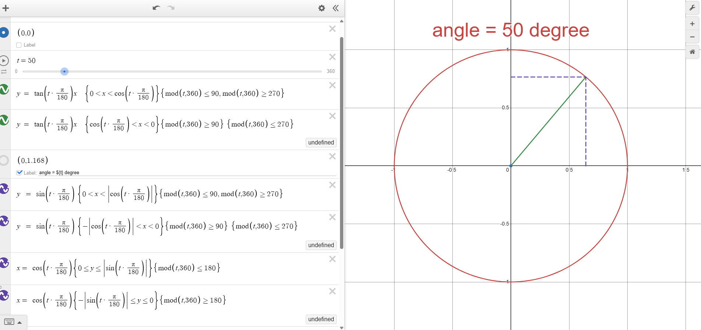

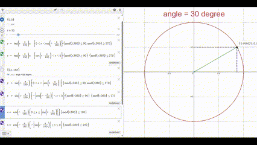

https://www.desmos.com/calculator/bgmd60sicg

# Draw alien with 5 log and 5 exponential function

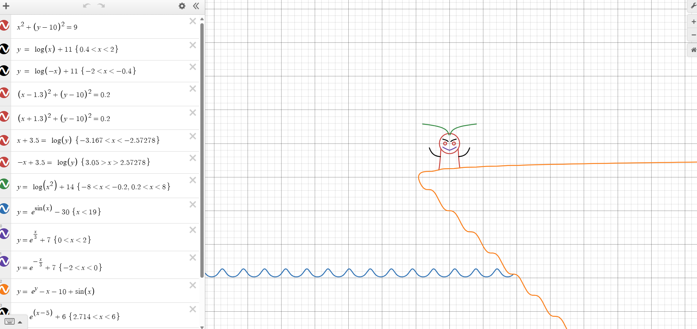

https://www.desmos.com/calculator/x4knhned8e

# Geometry problem from thailand math olympiad excercise 

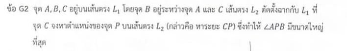

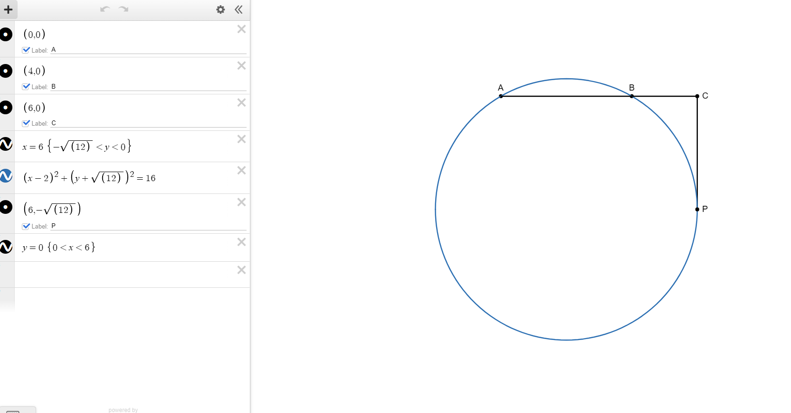

https://www.desmos.com/calculator/ekd3s999nu

# Mathematical mistake from the Official solution of thailand physics olmypiad exam

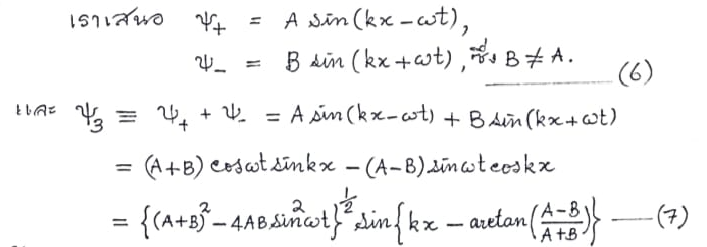
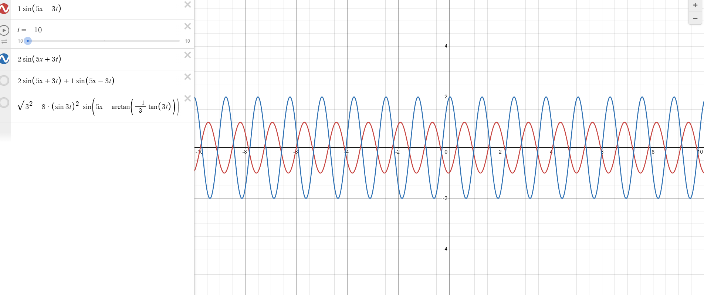

https://www.desmos.com/calculator/3cdkceidop

# 3 heavy damping SHM with same initial velocity

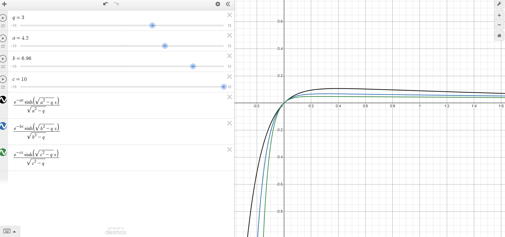

# Posn sliding in a hemisphere bowl problem

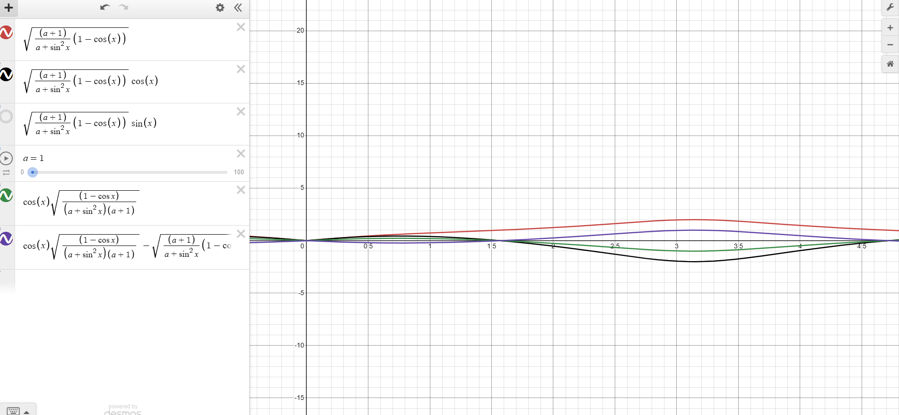

https://www.desmos.com/calculator/ux1q7na8aw

# Slipping pencil
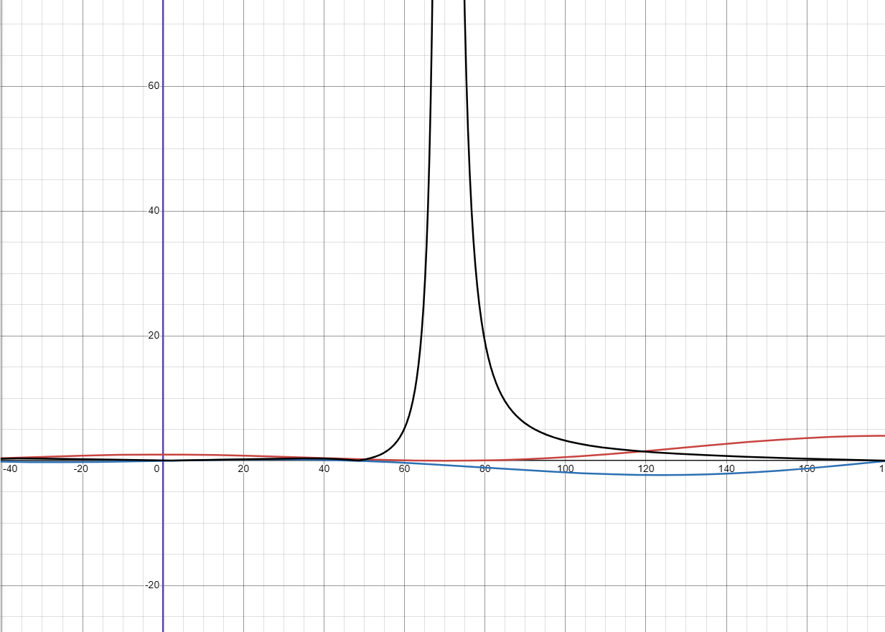

https://www.desmos.com/calculator/9gbzy8lteh

# Shortest sliding duration path in polar form
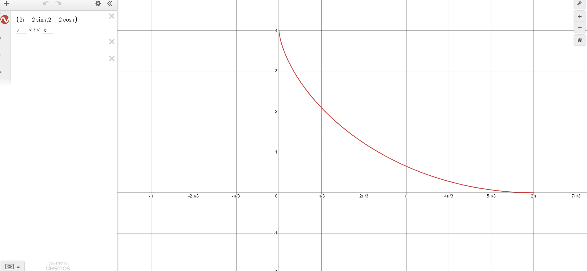

https://www.desmos.com/calculator/i0lmopo1ew

